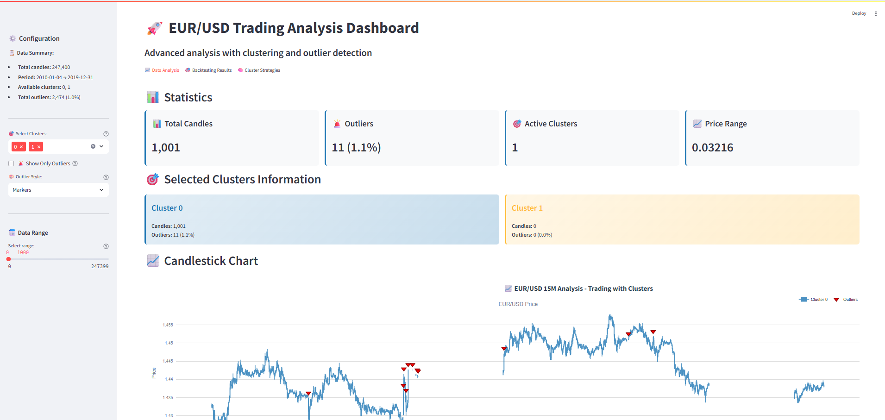
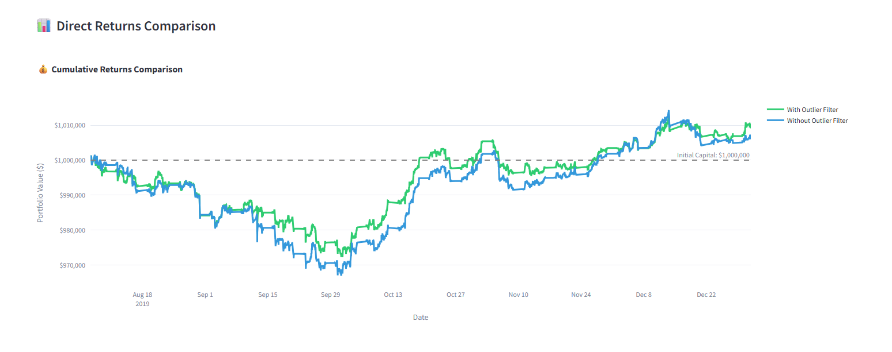
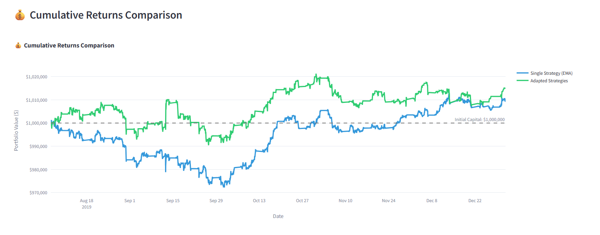

# 📈 EUR/USD Trading Analysis & Backtesting Platform

### Altair Global Student Contest 2025 — Market Masters

---

## 🚀 Project Overview

This comprehensive trading analysis platform combines **AI Studio (RapidMiner)** with advanced backtesting capabilities to analyze EUR/USD forex data. The project integrates machine learning-driven market regime detection with quantitative trading strategy optimization to create a complete trading research environment.

### Key Features

* 🤖 **AI-Powered Market Analysis**: Automated detection and classification of market regimes and anomalies using unsupervised learning
* 📊 **Interactive Visualization Dashboard**: Real-time data exploration with cluster analysis and outlier detection
* 🔬 **Advanced Backtesting Engine**: Multiple trading strategies with hyperparameter optimization using Optuna
* 📈 **Strategy Performance Analytics**: Comprehensive performance metrics and risk analysis
* 🎯 **Decision Support System**: AI-assisted trading insights combining regime detection with strategy signals

The platform enables traders and researchers to:
* 🧭 Identify *market regimes* and volatility clusters
* ⚠️ Detect *anomalous market events* and outliers  
* 🎯 Optimize *trading strategies* with data-driven parameter tuning
* 📋 Backtest *multiple strategies* across different market conditions
* 🔍 Analyze *risk-adjusted returns* and drawdown characteristics

### 📱 Interactive Web Dashboard


*Interactive Streamlit dashboard showing EUR/USD market analysis with cluster visualization and outlier detection*


*Comparative analysis showing the impact of outlier detection on trading strategy performance*


*Performance comparison between cluster-adapted strategies and traditional approaches*

---

## 🧩 System Architecture

### **1. Data Pipeline**

#### **Data Acquisition (`download_mt_data.py`)**
* Automated EUR/USD 15-minute OHLCV data download from MetaTrader 5
* Configurable time ranges and symbols
* Real-time data integration capabilities

#### **Data Processing (AI Studio + `data_merger.py`)**
* **Pre-processing (AI Studio):**
  * Missing value imputation and data cleaning
  * Z-score normalization for feature scaling
  * Unique ID assignment for data traceability

* **Feature Engineering:**
  * Multiple outlier detection methods (Isolation Forest, LOF, PCA-based)
  * Clustering algorithms (K-Means) for regime identification

* **Data Integration:**
  * Merges AI Studio outputs with original forex data
  * Creates enhanced dataset with `cluster` and `outlier_flag` columns
  * Maintains temporal consistency across all data sources

### **2. Visualization Dashboard (`app.py`)**

The **Streamlit Web Application** provides an interactive interface for data exploration:

#### **Core Features:**
* **📊 Interactive Candlestick Charts**: Real-time OHLCV visualization with cluster coloring
* **🎯 Outlier Detection Display**: Visual markers for anomalous market events
* **📈 Regime Analysis**: Color-coded market state identification
* **📋 Statistical Summaries**: Cluster distributions and outlier density metrics
* **🔍 Multi-view Modes**: 
  - Vertical lines for regime boundaries
  - Scatter markers for outlier events
  - Filtered views for specific analysis focus

#### **Advanced Analytics:**
* **Timeline Evolution**: How market regimes change over time
* **Cluster Characteristics**: Statistical properties of each market state
* **Outlier Analysis**: Frequency and distribution of anomalous events
* **Interactive Filtering**: Dynamic data exploration capabilities

### **3. Backtesting Engine (`backtesting/`)**

#### **Strategy Framework (`strategies.py`)**
Multiple quantitative trading strategies with configurable parameters:

* **📈 EMA Strategy**: Exponential Moving Average crossover signals
* **📊 RSI Strategy**: Relative Strength Index momentum signals  
* **🌊 MACD Strategy**: Moving Average Convergence Divergence signals
* **📉 Bollinger Bands**: Price envelope breakout/reversion signals
* **⚡ Stochastic Strategy**: Stochastic oscillator momentum signals

Each strategy implements:
- Parameterized signal generation
- Entry/exit logic optimization
- Risk management controls
- Performance tracking metrics

#### **Model Architecture (`model.py`)**
* **Base Model Classes**: Abstract framework for strategy implementation
* **Signal Processing**: Advanced signal filtering and timing optimization
* **Risk Management**: Position sizing and drawdown protection
* **Performance Analytics**: Comprehensive backtesting metrics

#### **Optimization Engine (`train.py`, `cluster_train.py`)**
* **🔧 Hyperparameter Optimization**: Optuna-based parameter tuning
* **📊 Multi-objective Optimization**: Balancing returns vs. risk metrics
* **🎯 Cluster-aware Training**: Strategy optimization per market regime
* **📈 Performance Validation**: Out-of-sample testing and validation

#### **Utilities (`utils.py`)**
* **Data Loading**: Efficient data preprocessing for backtesting
* **Signal Processing**: Signal shifting and timing adjustments
* **Position Management**: Entry/exit validation and overlap prevention
* **Outlier Filtering**: Integration with AI Studio outlier detection

---

## 📊 Project Structure

```
Altair-AI-Studio-Comp/
├── 📱 app.py                              # Streamlit visualization dashboard
├── 🔄 data_merger.py                      # Data integration pipeline  
├── 📥 download_mt_data.py                 # MetaTrader 5 data acquisition
├── 📖 README.md                           # Project documentation
│
├── 🎯 aistudio/                          # AI Studio workflows
│   └── comp_process.rmp                   # RapidMiner process file
│
├── 🔬 backtesting/                       # Trading strategy backtesting
│   ├── 📊 strategies.py                   # Trading strategy implementations
│   ├── 🤖 model.py                        # Model architecture and base classes
│   ├── 🏋️ train.py                        # Strategy optimization engine
│   ├── 🎯 cluster_train.py                # Cluster-aware optimization
│   ├── 🛠️ utils.py                        # Backtesting utilities
│   ├── 📈 optimization_results_*.csv      # Optimization results
│   └── 📋 cluster_optimization_*.json     # Cluster-specific results
│
├── 📂 data_raw/                          # Original market data
│   └── EURUSD_15M.csv                     # Raw EUR/USD 15-minute data
│
├── 📊 data_preprocessed/                 # Processed datasets
│   ├── enhanced_eurusd_dataset.csv       # Merged dataset with ML features
│   └── results.csv                       # AI Studio analysis results
│
└── 🖼️ imgs/                              # Documentation assets
    └── altair-process.pdf                 # AI Studio process visualization
```

---

## 🛠️ Technical Stack

| Component | Technology | Purpose |
|-----------|------------|---------|
| **Data Processing** | Altair AI Studio (RapidMiner) | Unsupervised ML pipeline |
| **Visualization** | Streamlit + Plotly | Interactive dashboard |
| **Backtesting** | vectorbt + Optuna | Strategy optimization |
| **Data Source** | MetaTrader 5 API | Real-time forex data |
| **ML Framework** | scikit-learn (via AI Studio) | Clustering & outlier detection |
| **Backend** | Python 3.10+ | Core application logic |
| **Data Analysis** | pandas + numpy | Data manipulation |
| **Optimization** | Optuna | Hyperparameter tuning |

---

## 🎯 Key Workflows

### **Machine Learning Pipeline**
1. **Data Acquisition**: Download EUR/USD data via MT5 API
2. **Preprocessing**: Clean, normalize, and feature engineer in AI Studio
3. **Dimensionality Reduction**: Apply PCA for variance analysis
4. **Outlier Detection**: Identify anomalous market conditions
5. **Clustering**: Segment market into behavioral regimes
6. **Integration**: Merge ML outputs with original data

### **Strategy Development**
1. **Strategy Design**: Implement trading logic in strategy classes
2. **Parameter Optimization**: Use Optuna for hyperparameter tuning
3. **Regime-Aware Training**: Optimize strategies per market cluster
4. **Performance Validation**: Comprehensive backtesting analysis
5. **Risk Assessment**: Drawdown and risk-adjusted metrics

### **Analysis & Visualization**
1. **Dashboard Launch**: Interactive Streamlit application
2. **Data Exploration**: Multi-dimensional market analysis
3. **Regime Identification**: Visual cluster and outlier analysis
4. **Strategy Comparison**: Performance metrics across strategies
5. **Decision Support**: AI-assisted trading insights

---

## 🌍 Real-World Applications

### **Trading Applications**
* **📊 Portfolio Management**: Multi-strategy allocation based on market regimes
* **⚠️ Risk Management**: Outlier-aware position sizing and risk controls
* **🎯 Signal Generation**: AI-enhanced entry/exit timing optimization
* **📈 Performance Monitoring**: Real-time strategy performance tracking

### **Research Applications**
* **🔬 Market Microstructure**: Analysis of forex market behavioral patterns
* **🤖 Algorithm Development**: Framework for ML-driven trading research
* **📊 Regime Analysis**: Understanding market state transitions
* **🎯 Strategy Innovation**: Platform for developing new trading approaches

### **Educational Applications**
* **📚 Quantitative Finance**: Complete trading research environment
* **🤖 Machine Learning**: Practical application of unsupervised learning
* **📊 Data Science**: End-to-end data pipeline implementation
* **💼 Financial Technology**: Integration of AI with trading systems

---

## 🚀 Future Enhancements

### **Technical Roadmap**
* **🔄 Real-time Integration**: Live data feeds and automated trading
* **🌐 Multi-Asset Support**: Extension to stocks, commodities, and crypto
* **🤖 Deep Learning**: Advanced neural network architectures
* **☁️ Cloud Deployment**: Scalable cloud infrastructure

### **Research Directions**
* **🧠 Reinforcement Learning**: AI agents for dynamic strategy adaptation
* **📊 Alternative Data**: Integration of sentiment and news analytics
* **🎯 Multi-timeframe Analysis**: Cross-timeframe regime detection
* **🔍 Explainable AI**: Enhanced interpretability of ML decisions

---

## 🏆 Impact & Innovation

This platform represents a significant advancement in quantitative trading research by:

* **🔗 Bridging AI & Finance**: Seamless integration of machine learning with trading systems
* **📊 Democratizing Quant Research**: Accessible tools for strategy development
* **🎯 Practical Application**: Real-world trading insights from academic research
* **🌟 Open Innovation**: Extensible framework for community contributions

The combination of **explainable AI**, **interactive visualization**, and **rigorous backtesting** creates a comprehensive platform that empowers traders, researchers, and students to understand and exploit market dynamics through data-driven approaches.

---

## 🎓 Authors & Acknowledgements

**Market Masters Team**  
*Esteban Sánchez Gámez & Pablo Jesús Delgado Muñoz*

**Technologies:** Altair AI Studio, Python, Streamlit, vectorbt, Optuna, MetaTrader 5

**Special Thanks:** Altair Engineering for providing the AI Studio platform and contest framework.

---

*Built with ❤️ for the quantitative trading community*